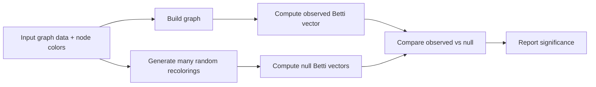

# clique-homology

`clique-homology` is a Python project for studying network structure with topological summaries (Betti numbers), with an emphasis on colored networks such as neuron connectivity graphs.

This README is a newcomer overview of what the codebase is intended to do and what each implemented piece takes as input and returns as output.

## What this project is for

The goal is to help researchers compare network organization beyond pairwise edges by:

- building clique-based simplicial structures from graphs,
- computing Betti numbers from those structures,
- and testing whether observed structure is stronger than chance using recoloring-based null models.

## What the homology should mean (visual)

The graph edges stay the same.  
Color labels decide which cliques are allowed to become simplices:

- A clique is included only if all its vertices share one color.
- Mixed-color cliques are ignored for simplex filling.

That means color can change topology even when the underlying graph is unchanged.

### Triangle example

Case A: mixed colors on a 3-cycle  
(`R`, `B`, `G` are different colors)

```text
R ----- B
 \     /
  \   /
    G
```

- All three edges exist, so there is a 1-cycle.
- The 2-simplex is not added (triangle is not unicolored).
- Result intuition: `beta_1 = 1` for this loop.

Case B: one color on the same 3-cycle  
(`R`, `R`, `R`)

```text
R ----- R
 \     /
  \   /
    R
```

- The triangle is a unicolored 3-clique, so it is filled as a 2-simplex.
- Its boundary cancels the loop.
- Result intuition: `beta_1 = 0` for this local structure.

### End-to-end workflow (target behavior)



## Current codebase map

- `src/clique_homology/stats_engine/betti_numbers.py`
  - Core homology pipeline and Betti number computation.
- `src/clique_homology/stats_engine/random_coloring.py`
  - Utilities for randomizing node colors.
- `src/clique_homology/stats_engine/null_distribution.py`
  - Repeated randomization + recomputation for null distributions.
- `src/clique_homology/__init__.py`
  - Package exports (`betti_numbers`, `random_coloring`, `Color`).
- `src/clique_homology/data_model/`
  - Data-model/CLI layer (currently incomplete).

## I/O overview (implemented APIs)

### 1) `betti_numbers`

Location: `src/clique_homology/stats_engine/betti_numbers.py`

Input:
- `G`: graph object (current implementation is written around `networkit.Graph`)
- `colors: list`
  - one color label per node
  - node order must match graph node IDs
- `method: str = "clique"`
  - `"clique"`: combine monochromatic cliques, return one Betti vector
  - `"subgraph1"`: compute per color-induced subgraph, return matrix (one row per color group)
  - `"subgraph2"`: same as `subgraph1` then aggregate rows, return one Betti vector

Output:
- `np.ndarray`
  - vector shape for `"clique"` and `"subgraph2"`
  - matrix shape for `"subgraph1"`

### 2) `random_coloring`

Location: `src/clique_homology/stats_engine/random_coloring.py`

Input:
- `colors: list[Color]`
- `proportional: bool = False`

Output:
- `list[Color]` of same length as input

Behavior:
- `proportional=False`: sample from unique color set in the input
- `proportional=True`: sample from full input list (preserves frequencies in expectation)

### 3) `null_distribution`

Location: `src/clique_homology/stats_engine/null_distribution.py`

Input:
- `graph: Graph`
- `coloring: list[Color]`
- `iterations: int = 100`

Output:
- `list[np.ndarray]`
  - one Betti-number result per iteration

Behavior:
- each iteration recolors nodes randomly and recomputes Betti numbers.

## Typical workflow

1. Build/load a network graph.
2. Provide one node-color list aligned with node IDs.
3. Compute observed Betti numbers with `betti_numbers`.
4. Generate random baseline results with `null_distribution`.
5. Compare observed vs null summaries.

## Statistical significance plan

Betti numbers are a vector, so dimensions can be dependent.  
To handle this, the project should report both a global test and per-dimension summaries.

1. Keep the graph fixed and randomize only colors.
2. Preserve color counts during randomization (permutation-style null).
3. Compute observed Betti vector `b_obs`.
4. Compute null vectors `b_1, ..., b_N` from many recolorings.
5. Global significance:
   - Use a single distance statistic from observed to null center, using covariance of the null vectors.
   - Convert to an empirical permutation p-value:
     - `p_global = (1 + # {T_i >= T_obs}) / (N + 1)`.
6. Dimension-wise significance:
   - For each Betti index `k`, compute empirical two-sided p-value from the null marginal for `beta_k`.
   - Apply FDR correction across `k` values for reporting.

What this gives:
- `p_global`: "Is the overall topological signature unusual?"
- corrected per-Betti p-values: "Which homology dimensions drive the effect?"

This avoids assuming independent Betti components and stays consistent with the recoloring null model.

## Project status

This repository is still in active development.

- Core topology/statistics engine is usable.
- Data loading and CLI layers in `data_model` are not complete yet.

## Supporting materials

- `docs/demo.ipynb`
- `docs/demo2.ipynb`
- `docs/data/C-elegans-frontal.csv`
